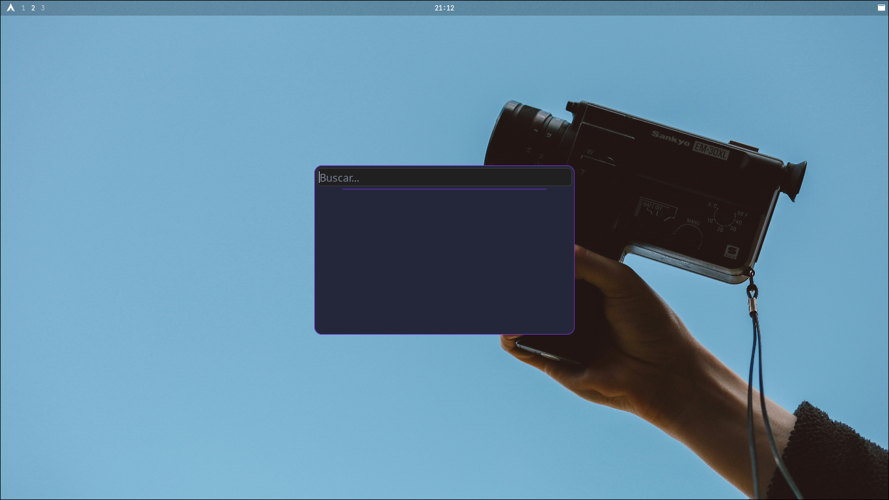
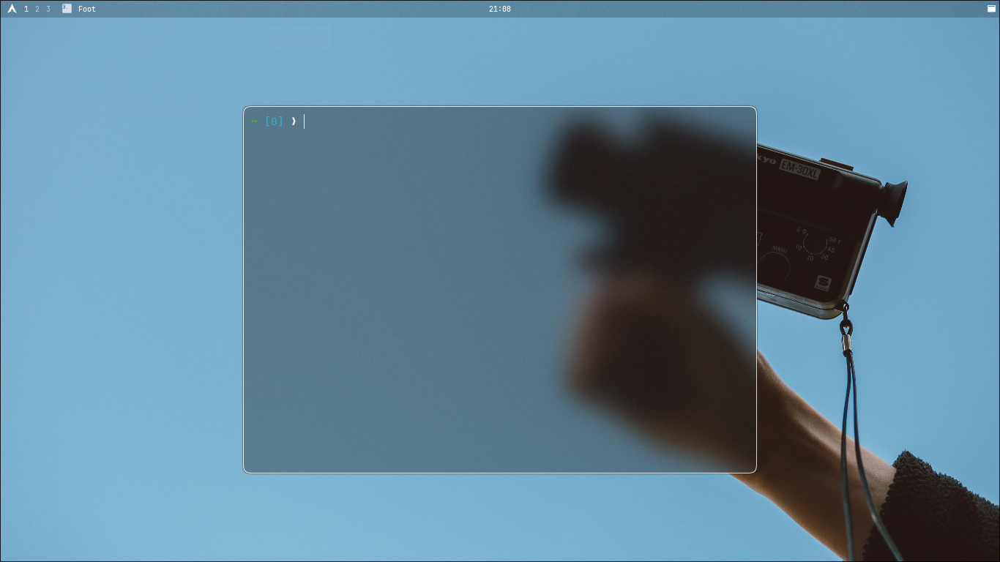
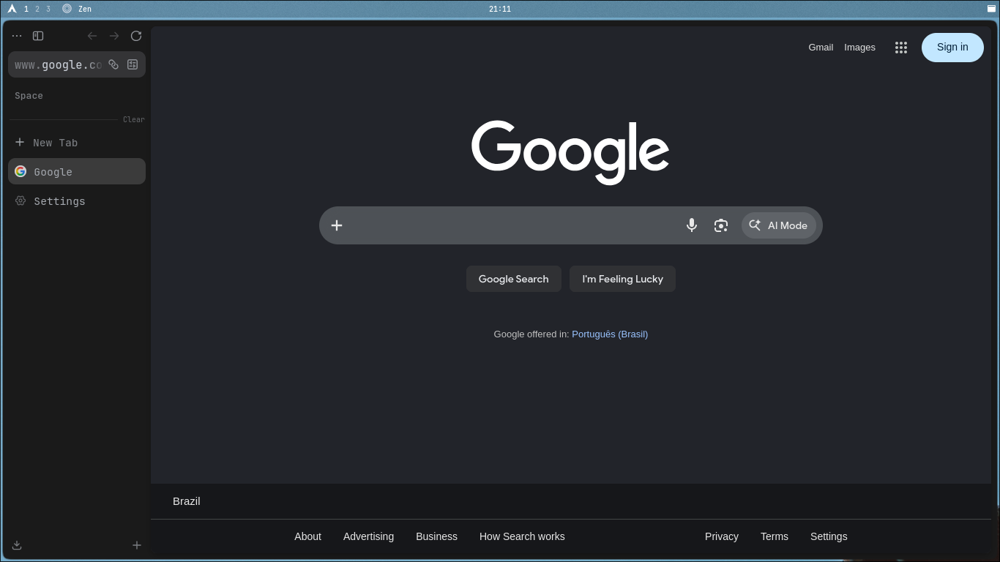
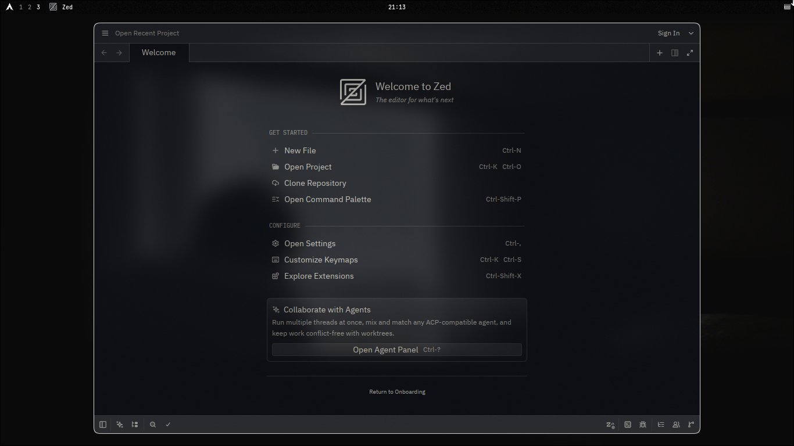

# Hyprland Dotfiles

A minimalist and reproducible Hyprland (Wayland) configuration focused on aesthetics, functionality, performance, simplicity, and a clean user experience (UX).

This repository provides:
- A complete Wayland environment (Hyprland + Waybar + Foot + Mako)
- A modular installer with bootstrap, install, update, rollback, and status flows
- Optional symlink-based deployment for easy maintenance
- A clean and lightweight workflow optimized for daily use

## Table of Contents
- [Features](#features)
- [Components](#components)
- [Installation](#installation)
- [Dependencies](#dependencies)
- [Repository Structure](#repository-structure)
- [Manual Installation](#manual-installation)
- [Notes](#notes)

## Features

### Keybindings (ALT as main modifier)
- `ALT + T`: Open terminal (Foot)
- `ALT + E`: Open file manager (Nautilus)
- `ALT + R`: Open app launcher (Bemenu)
- `ALT + F`: Open browser (Firefox)
- `ALT + Q`: Close active window
- `ALT + V`: Toggle floating mode
- `ALT + S`: Toggle scratchpad (Spotify workspace)
- `WIN + R`: Reload Hyprland configuration
- `WIN + F1`: Toggle gamemode
- `ALT + 1-0`: Switch workspaces
- `ALT + SHIFT + 1-0`: Move window to workspace

### System Features
- Automatic Spotify scratchpad on a special workspace
- Screenshot tools (hyprshot) for full screen and region capture
- Gamemode toggle with visual notifications
- System monitor (btop) accessible via keybinding
- Quick configuration reload with notification

### Appearance
- Custom workspace icons
- Transparent inactive windows (70% opacity)
- Blur effects enabled
- Rounded corners (8px)
- Custom cursor theme (Qogir)
- YAMIS icon theme (auto-installed)

## Components

- **Window Manager**: Hyprland with Master/Dwindle layouts, custom animations, blur, and transparency effects
- **Bar**: Waybar with Spotify integration, app launchers, system monitoring, and weather widget
- **Terminal**: Foot with JetBrains Mono Nerd Font
- **Notifications**: Dunst with custom themes and gamemode indicators
- **Shell**: Bash with Ble.sh enhancement and custom prompt ("ふあん")

## Installation

Clone the repo and run the installer from inside the project directory.

```bash
git clone https://github.com/YOUR_USER/dotfiles-hyprland.git ~/.local/share/dotfiles-hyprland
cd ~/.local/share/dotfiles-hyprland
./install.sh
```

The default run uses the `auto` flow (`bootstrap + install`).

### Warning
The installer can deploy files in two modes:
- **default**: copies files to your `$HOME`
- **--symlink**: symlinks files from this repo into your `$HOME` (do not move the repo folder after installation)

### Installer Commands
```bash
./install.sh [command] [options]
```

| Command | Description |
| :--- | :--- |
| `(none)` | Full auto: bootstrap + install |
| `bootstrap` | Install base system from scratch |
| `install` | Deploy dotfiles |
| `update` | Re-deploy only changed files |
| `rollback` | Restore last backed-up files |
| `status` | Show current install state |

## Dependencies

- hyprland, waybar, foot, dunst
- hyprpaper, hypridle, bemenu
- nautilus, firefox, btop
- playerctl, hyprshot, ble.sh

## Repository Structure

```text
.
├── .bashrc              # Shell configuration with custom prompt
├── .blerc               # Ble.sh configuration
├── .config/
│   ├── hypr/            # Hyprland configurations
│   ├── waybar/          # Bar configuration
│   ├── foot/            # Terminal emulator settings
│   └── dunst/           # Notification daemon
├── Wallpapers/          # Wallpaper collection
└── install.sh           # Installation script
```

## Manual Installation

If you prefer to do everything manually:
1. Install core dependencies.
2. Copy/Symlink `.config/` entries to `~/.config/`.
3. Copy `.zshrc` and `.gtkrc-2.0` to your `$HOME`.
4. Copy `Wallpapers/` to `~/Pictures/Wallpapers/`.

## Notes
- Primarily designed for **Arch-based** distributions.
- Use `--dry-run` to preview all actions before applying them.

- ## Preview

| Desktop | Terminal |
|---|---|
|  |  |

| Fuzzel | Alt desktop |
|---|---|
|  |  |
